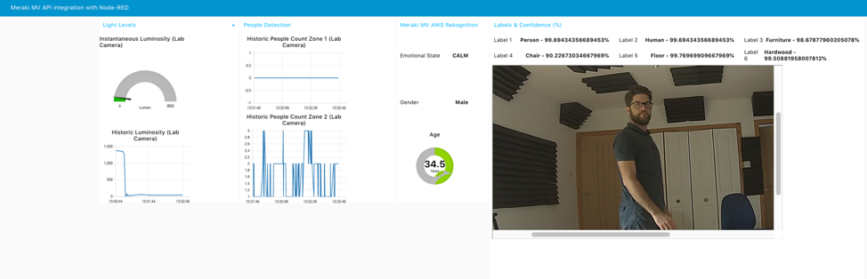

# Overview

This document provides a step by step guide to enabling visualization of some of the [MV](https://meraki.cisco.com/products/security-cameras) Cameras sensor data and snapshots, augmented with Image Analysis from AWS [Regoknition](https://aws.amazon.com/rekognition/), using [NodeRED](https://nodered.org/) as a User Interface.

The high level flow is as follows:

1. An  MV camera provides an MQTT stream to an MQTT Broker running in NodeRED . The MQTT stream includes people count (by zone) and luminosity.
2. Every few seconds, A python script requests the URL of a snapshot from our MV camera
3. The Meraki Cloud returns a URL to the Python Script
4. The URL is forwarded to the AWS Rekognition service. AWS Rekognition downloads the snapshot using the URL and performs Machine Learning based object and face recognition on the snapshot
5. AWS recognition returns the result of the object and facial analysis to the Python Script (e.g. house, computer, phone, Male, 40 years old, sad)
6. The results are forwarded in MQTT to an MQTT Broker, along with the snapshot URL
7. The MQTT Broker forwards this (along with the earlier details around People Count and Luminosity) to NodeRED&#39;s Graphical User Interface
8. The information is presented by NodeRED, including the snapshot image URL

# Dependencies

The solution has been tested against the following:

* Ubuntu 18.04.2 LTS

* Python 3.6.8

* boto3==1.9.181

* paho-mqtt==1.4.0

* configparser==5.0.0

* paho-mqtt==1.4.0

* NodeRed v1.0.4

* Meraki Camera Firmware v4.3

# Steps

## Installation

### Create a Virtual Environment:
virtualenv venv

### Activate the virtual Environment:
source venv/bin/activate

### Clone the Repo:
git clone https://github.com/andersm9/Meraki-Computer-Vision
Cd Meraki-Computer-Vision

### Install the requirements:
pip3 install -r requirements.txt

Create and configure the 'credentials.ini' file as per the instructions below:

## Create a file "credentials.ini" with the following contents:

#Meraki dashboard credentials

[meraki]

#Primary API key for admin account, with access to one or more orgs

key = \*\*your\_dash\_API\_key\*\*

#e.g. key = 187cd12d3957a98c598cd560d7290c56cd786cd89c

#Personal org's network ID that contains cameras

network = \*\*your\_NW\_ID\*\*

#e.g. network = L\_543212345678917680

#For MV Sense MQTT

[sense]

serial = \*\*camera\_serial\*\*

#e.g. serial = Q4EV-HXLN-QGGY

#Server address and port

[server]

ip = \*\*server\_URL\*\*

#e.g. ip = ec2-54-171-108-161.eu-east-1.compute.amazonaws.com

### Notes

The 'credentials.ini' file should reside in the same directory as the 'meraki_cv.py' script

The solution is currently designed for a single camera.

The administrator that created your API key needs full access (read-only will not supply a snapshot URL via the API)

You can check the operation of the snapshot API with the following command:

curl -L -H 'X-Cisco-Meraki-API-Key: <api_key>' -X POST 'https://api.meraki.com/api/v0/networks/<Net_ID>/cameras//snapshot'

e.g.

curl -L -H 'X-Cisco-Meraki-API-Key: 1xbxbb3b5xb2b2b0ab7350d72b0cb7cdd8d9033e' -X POST 'https://api.meraki.com/api/v0/networks/L_176760844512417683/cameras/Q2EV-HYLV-THHY/snapshot'

## Dashboard Configuration

### Enable Sense for the camera on the Meraki Dashboard:

  Cameras -  Camera – Settings - Sense - Enable

### Create 2 Zones on your camera, one on the left half of the frame, one on the right half

  Cameras -  Camera – Settings - Zones

### Create and use an MQTT Broker using NodeRed Mosca

  Cameras -  Camera – Settings - Sense - Add or edit MQTT Brokers

  Your server IP, port 1883, security &quot;None&quot;

Note your camera’s published topics e.g. /merakimv/Q2SV-HTLN-QFGY/light

## Node-RED

1. Install node.js and Node-RED on your server:

        $sudo apt-get install -y nodejs
        $sudo apt-get install npm
        $sudo npm install -g --unsafe-perm node-red

2. Start Node-RED (manually) e.g. on ubuntu

        $node-red

3. _optionally_ – Use PM2 to start node-red on boot (Ubuntu):

        $sudo npm install -g pm2

4. _optionally_ Configure PM2 on Ubuntu:

        $pm2 start /usr/local/bin/node-red -- -v

Ref: [https://nodered.org/docs/getting-started/running
](https://nodered.org/docs/getting-started/running)

c) Open Firewall ports:

Open the following incoming TCP ports on the security group for your server:

* 1880 (Node-RED GUI)

* 1883 (MQTT)

d) Navigate to the Node-RED configuration page at:

http://**yourserver**:1880

 e) Install Mosca MQTT Broker

Start- Manage Palette -  Install - ; node-red-contrib-mqtt-broker

f) Install NodeRed Dashboard

Start - Manage Palette -  Install -  node-red-dashboard

g) Import the following flow: (start - import - clipboard - select a file to import)

[https://github.com/andersm9/Meraki\_NodeRED/blob/master/Flow](https://github.com/andersm9/Meraki_NodeRED/blob/master/Flow)

                **Update this when ready**

h) Press Import;

i) Press Deploy;

UI should be available at http://**yourserver**:1880/ui, (though not yet receiving any MQTT feeds)

j) Subscribe to your cameras MQTT topic in NodeRed:

* “Luminosity Chart” Flow - “mqtt in” node - Topic =

/merakimv/**your-camera-serial**/light

e.g.:

/merakimv/ Q2SV-HTLN-QFGY/light

* “People Count by Zone” flow - “mqtt in” node -

merakimv/**your-camera-serial**/**your-zone-ID**

e.g.:

/merakimv/ Q2SV-HTLN-QFGY/676665844012417062

Repeat for the other zone topic in the other mqqt in node

i) Press Deploy

## Python Script:

Install the following script on your server in the same directory as the “credentials.ini” file created earlier”

[https://github.com/andersm9/NodeRed\_AWS\_Rekognition/blob/master/AWS\_Rek6.py](https://github.com/andersm9/NodeRed_AWS_Rekognition/blob/master/AWS_Rek6.py)

Start the python script:

$python3 meraki\_cv.py

# Conclusion

You should now see (in the NodeRed GUI) a graphical readout of luminosity, people counting by Zone, AWS Rekognition emotion/gender/age, object detection, text detection and a snapshot.

